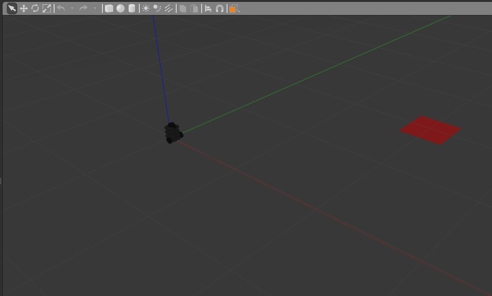

# Differential Drive Controller

## Overview

This is a template: replace, remove, and add where required. Describe here what this package does and what it's meant for in a few sentences.

**Keywords:** Controller, Turtlebot3, Example

### License

The source code is released under a [BSD 3-Clause license](ros_package_template/LICENSE).

**Author: Jeferson Lima 
Affiliation: [UTFPR](https://www.utfpr.edu.br) 
Maintainer: Jeferson Lima, jefersonlima@utfpr.edu.br**

The DIFFERENTIAL_DRIVE_CONTROLLER package has been tested under [ROS] Noetic on respectively Ubuntu 20.04.
This is research code, expect that it changes often and any fitness for a particular purpose is disclaimed.

## Installation

### Building from Source

#### Dependencies

- [Robot Operating System (ROS)](http://wiki.ros.org) (middleware for robotics),

    sudo rosdep install --from-paths src

#### Building

To build from source, clone the latest version from this repository into your catkin workspace and compile the package using

    cd catkin_workspace/src
    git clone https://gitlab.com/jeferson.lima/diff_drive_controller.git
    cd ../
    rosdep install --from-paths . --ignore-src
    catkin_make

### Unit Tests (WIP)

Run the unit tests with

    catkin_make run_tests_diff_drive_controller

## Usage

Describe the quickest way to run this software, for example:

Run the main node with

    roslaunch diff_drive_controller pid_controller.launch

## Config files

Config file config/control.yaml

* **control.yaml** Controller parameters

## Nodes

### diff_drive_controller

Reads `odom` and computed the control to publish in `cmd_vel`.

#### Subscribed Topics

* **`/dist_error`** ([std_msgs/Float64](http://docs.ros.org/en/noetic/api/std_msgs/html/msg/Float64.html))

	The Target Distance Error.

* **`/angle_error`** ([std_msgs/Float64](http://docs.ros.org/en/noetic/api/std_msgs/html/msg/Float64.html))

	The Target Angle Error.

## Bugs & Feature Requests

Please report bugs and request features using the [Issue Tracker](https://gitlab.com/jeferson.lima/diff_drive_controller/-/issues).

# References

* [ROS Best Practices](https://github.com/leggedrobotics/ros_best_practices)

